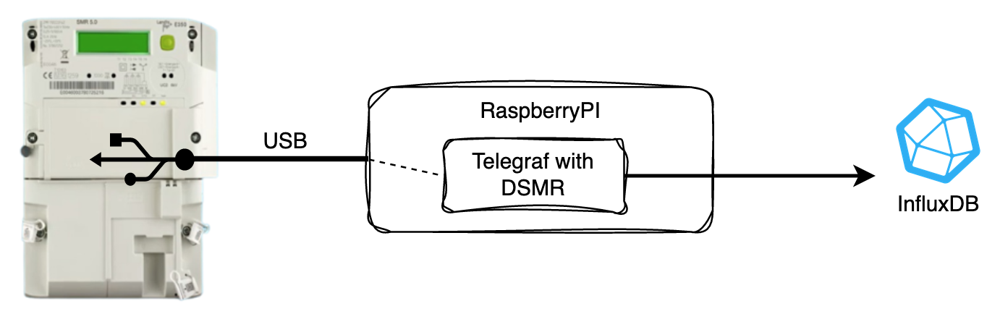

# Read DMSR with Telegraf into InfluxDB

Smart electricity meters communicate metrics with the DSMR protocol. To read
that data this solution uses [Telegraf](https://github.com/influxdata/telegraf)
and [DSMR Parser](https://github.com/ndokter/dsmr_parser) via USB. There are
probably more efficient solutions but for this solutions I wasn't up to make
my own complete solution and wanted to use existing things. 

This project is a part of my solution and focusses on reading data. I use InfluxDB but since Telegraf is flexible with output plugins you can change this to any solution. 

Main components:

* Telegraf: The Swiss army knife for metrics. Lots of plug-ins for data collection and writing with out of the box resilience for errors/unavailability of any components
* DSMR Parser: reads DMSR protocol over USB and translates this into readible information
* Docker: To bundle Telegraf en DSMR 
* P1 USB Cable: [search](https://duckduckgo.com/?q=p1+usb+kabel)



Required software:

* Docker - everything is packaged into one container


## Collected data

Reading is done from `dsmr.py`. This uses the DSMR Parser library and reads a number of fields from the DSRM message and writes them as InfluxDB Line Protocol to standard out. This script is copied with dependencies into the Docker container.

The input is the P1 USB Cable device.

To adjust the script see the DSMR Parser documentation. DSMR Parser is pinned at version 0.33 as this was the available version during development.

## Storage

Installation and running InfluxDB is left out of this project. Pick any output plugin Telegraf has that suite your needs. 

In case Influx is your choice, please refer to the InfluxDB website for [this](https://docs.influxdata.com/influxdb/v2.6/install/?t=Docker). After installation create a bucket to store the data. Also create a [token](https://docs.influxdata.com/influxdb/v2.6/security/tokens/create-token/) to use in the Telegraf configuration as authentication.


## Telegraf configuration

For reading data telegraf is configured using the default file `/etc/telegraf/telegraf.conf`. This file contains the input plugin configuration.

The output is defined using the configuration directory option where separate `.conf` files can be placed. By default the collected input is written to `stdout`. To write to InfluxDB create your own file based on `output_influxdb.conf.sample` and set the configuration as host and bucket for the InfluxDB target.

## Running with Docker

To run the solution first build the image with `make image`. The image grows quite large in file containing botht Telegraf and Python. Still the size is almost equal to the original Telegraf images that don't contain Python. 

To run the image execute

```
docker run -d --device=/dev/ttyUSB0 \
  --name=smart_meter \
  -v "${PWD}/telegraf.d:/etc/telegraf.d:ro" \
  cwesdorp/smart_meter_telegraf:latest
```
 
Update the configuration files in `telegraf.d` or provide your own folder to overwrite the output. 

## Other solutions 

There are several other solutions to connect to the P1 port of a meter and also facilitate storage and display. There are several vendors of USB cables, just [search](https://duckduckgo.com/?q=p1+usb+kabel). Some project I found (but didn't try) to read DSMR are

* [DSMR Tools](https://dsmr.basjes.nl/)
* [DSMR Reader](https://github.com/dsmrreader/dsmr-reader)

Another solution can be P1 dongles that either can be read locally or submit data directly to the internet. 

* [HomeWizard P1](https://www.homewizard.com/p1-meter/)

